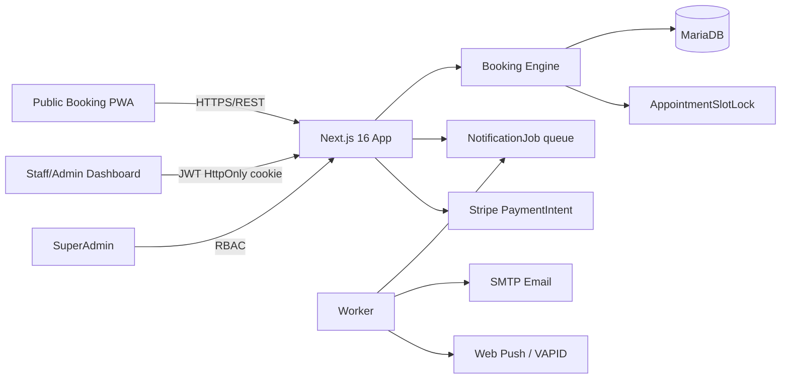
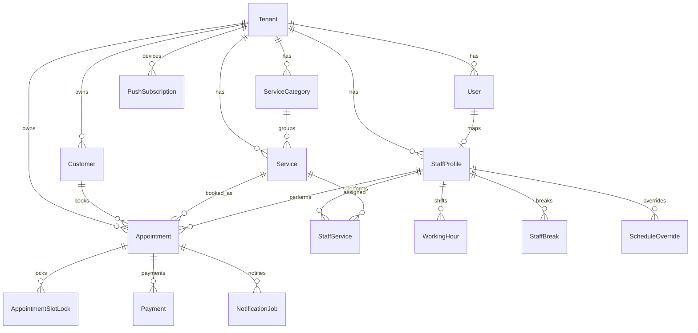

# Linea+ Rezervacije — arhitektura

## Multi-tenant granica

`tenantId` je obavezan na svim poslovnim entitetima. API nikada ne prima tenant iz admin bodyja kao izvor istine: tenant dolazi iz sessiona. `SUPERADMIN` je jedina uloga koja smije prelaziti tenant granice.

## Booking algoritam

1. Učitaj tenant, timezone i `slotStepMinutes`.
2. Učitaj uslugu i staff-service override trajanja/cijene.
3. Presijeci radno vrijeme salona s radnim vremenom djelatnika.
4. Primijeni `ScheduleOverride` (`WORKING` ili `BLOCKED`).
5. Za svaki kandidat računaj interval `[start-prep, start+duration+cleanup)`.
6. Izbaci kandidat koji udara u pauzu, override ili postojeći appointment lock interval.
7. Za “Bilo tko” izračunaj sve djelatnike i za svako vrijeme vrati prvog dostupnog.
8. Kod rezervacije ponovno provjeri slot i u `Serializable` transakciji kreiraj termin + 5-minutne `AppointmentSlotLock` retke.
9. Unique ključ `(staffId, startsAt)` pretvara race condition u kontrolirani `409 SLOT_TAKEN_RACE`.

## RBAC

| Uloga | Tenant | Termini | Klijenti | Staff/usluge | Billing | Svi tenant-i |
|---|---|---|---|---|---|---|
| STAFF | vlastiti | vlastiti | čitanje prema politici | ne | ne | ne |
| MANAGER | vlastiti | svi | da | da | ne | ne |
| OWNER | vlastiti | svi | da | da | da | ne |
| SUPERADMIN | svi | svi | svi | svi | platforma | da |

## Statusi termina

`PENDING` → čeka akontaciju ili ručnu potvrdu.  
`CONFIRMED` → termin vrijedi i blokira slot.  
`COMPLETED` → odrađen; ažurirati statistiku kupca.  
`CANCELLED` → slot-lockovi se brišu i vrijeme je ponovno slobodno.  
`NO_SHOW` → povećati `noShowCount`; policy može automatski blokirati klijenta.

## Cancellation policy

Tenant ima `cancellationHours`, default 12. Klijent dobiva kriptografski random manage token; u bazi se sprema samo SHA-256 hash. Otkazivanje oslobađa lockove, gasi buduće reminder jobove i šalje obavijest salonu i kupcu.

## Obavijesti

`NotificationJob` je outbox/queue tablica. Web request samo upisuje posao; worker ga šalje. To znači da spor SMTP ili push provider ne usporava booking i da se greške mogu retryati. MVP ima EMAIL + PUSH; SMS/WhatsApp imaju predviđene kanale i env varijable za Twilio adapter.

## Plaćanje

Stripe `PaymentIntent` je vezan na appointment. Za tenant s akontacijom termin kreće kao `PENDING`. Produkcijski webhook mora nakon `payment_intent.succeeded` postaviti `Payment=PAID` i `Appointment=CONFIRMED`; nakon isteka payment holda worker treba otkazati pending termin i obrisati slot lockove.

## ER pregled

